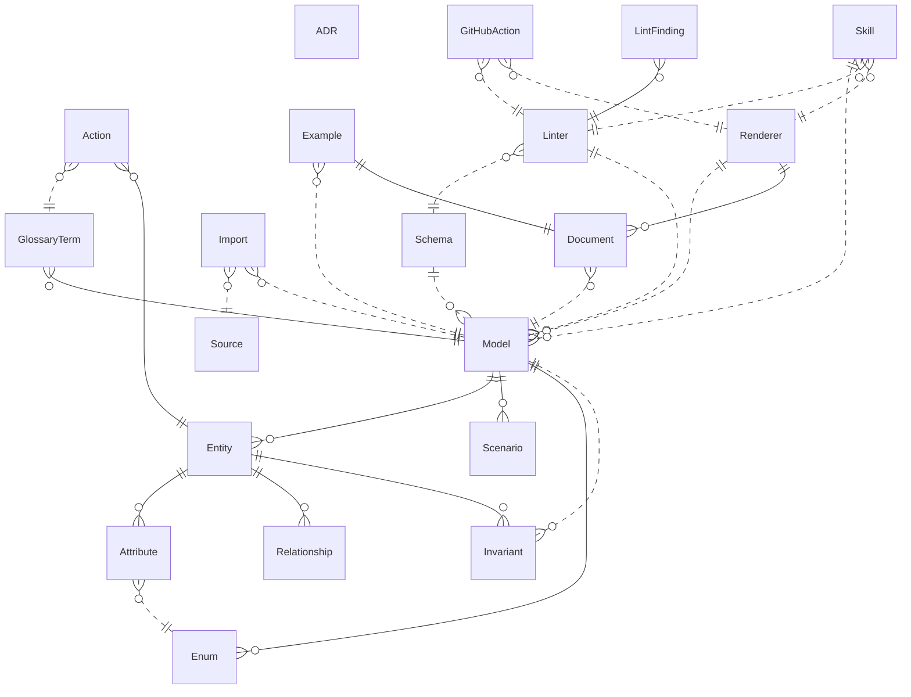

{/* Generated by `modelith render`. Do not edit by hand; edit the .modelith.yaml source and re-render. */}

# Modelith

Tooling for authoring domain models by conversation. An `Author` describes concepts in plain language to a `Skill`, which drafts the `Model` YAML. The `Linter` validates it against a `Schema`; the `Renderer` produces a `Document` committed alongside it. A `GitHubAction` enforces both in CI. A `Model` can `Import` vocabulary from other repos, pinned to a ref with provenance. The `Example` golden fixture pins the renderer's output; `ADR`s record the decisions that shaped the tool.

## Glossary

- **`Author`** — A human or agent who creates and edits a `Model` by conversation. Not modeled as an entity.
- **`Contributor`** — A human or agent working on modelith itself. Not modeled as an entity.

## Enums

### `FindingSeverity`

The classification of a `LintFinding`.

| Value | Definition |
| --- | --- |
| `error` | Must fix; the model is structurally or semantically invalid. |
| `warning` | Likely a bug — e.g. a dangling reference or ambiguous name. |
| `gap` | Advisory completeness gap — e.g. an entity with no invariants. |

### `HostKind`

The remote platform an `Import`'s `Source` points to.

| Value | Definition |
| --- | --- |
| `GitHub` | A github.com repository; transport delegates to `gh api`. |
| `ADO` | An Azure DevOps (dev.azure.com) repository; transport delegates to `az rest`. |

### `LintLayer`

The three ordered stages of a lint run.

| Value | Definition |
| --- | --- |
| `structural` | JSON Schema conformance; errors here block later stages. |
| `semantic` | Relationship targets exist, invariant ids resolve, backtick terms are defined. |
| `completeness` | Every entity has invariants; every entity is touched by a scenario. |

### `RendererBackend`

Which output format the `Renderer` targets.

| Value | Definition |
| --- | --- |
| `markdown` | A `Document` file (`*.modelith.md`) with an embedded Mermaid `erDiagram`. |
| `mermaid` | A standalone `erDiagram` block, used when the diagram is needed on its own. |

### `SkillName`

The three skills shipped in the Claude Code plugin.

| Value | Definition |
| --- | --- |
| `author` | domain-model-author — drives the conversation that produces a `Model`. |
| `lint` | domain-model-lint — runs the linter and interprets findings for the user. |
| `context` | domain-model-context — loads a model as context before a coding task. |

## Entities

### `ADR`

A forward-looking architecture decision record in `project-docs/adr/`. Records a hard-to-reverse call with real trade-offs, so intentions stay current. Retrospective records go in `project-docs/audits/` instead.

**Attributes**

| Name | Type | Description |
| --- | --- | --- |
| `number` | integer | The sequential ADR number (e.g. 9 for ADR-0009). |
| `title` | string | Short human-facing title of the decision. |

**Invariants**

- **adr-forward-looking** — An `ADR` records a decision made before or during implementation — it is forward-looking, not a retrospective audit.

### `Action`

An operation that may be performed on an `Entity`. Declares the `actor` (a `GlossaryTerm` role or another `Entity`), which `Invariant`s it `preserves`, and a prose `description`.

**Relationships**

- `GlossaryTerm` — n:1 — referenced — The actor role, when the actor is a glossary term rather than an entity.

**Attributes**

| Name | Type | Description |
| --- | --- | --- |
| `name` | string | The operation name (e.g. `archive`, `enter-with-keycard`). |
| `actor` | string | The `GlossaryTerm` role or `Entity` that performs this action. |
| `preserves` | string | List of `Invariant` ids this action must not violate. |
| `description` | string | Prose explanation of what the action does. |

**Invariants**

- **action-actor-resolves** — An `Action`'s actor is a declared `Entity` or `GlossaryTerm` — an undefined actor warns.
- **action-preserves-resolves** — Every `Invariant` id in an `Action`'s preserves list resolves to a declared `Invariant` — a dangling id is an error.

### `Attribute`

A typed property of an `Entity`. Its type is a primitive (`string`, `integer`, `boolean`, `timestamp`), a defined `Enum`, or a cross-model reference (`scope.Name`). An `Attribute` may be `derived` — computed from other state rather than stored.

**Relationships**

- `Enum` — n:1 — referenced — Set when the attribute's type is a defined `Enum`.

**Attributes**

| Name | Type | Description |
| --- | --- | --- |
| `name` | string | The property name in the owning `Entity`. |
| `type` | string | A primitive (`string`, `integer`, `boolean`, `timestamp`), a defined `Enum` name, or a cross-model reference (`payments.PaymentMethod`). |
| `derived` | boolean | True when the value is computed from other state rather than stored. |
| `derivation` | string | Prose explanation of how the value is computed; required when `derived` is true. |

**Invariants**

- **attribute-type-resolves** — An `Attribute`'s type is a lowercase primitive, the PascalCase name of a defined `Enum`, or a well-formed `scope.Name` cross-model reference.
- **attribute-derived-needs-derivation** — An `Attribute` marked `derived` must provide a `derivation` explaining how the value is computed.

### `Document`

The rendered Markdown file (`*.modelith.md`) committed alongside the `Model`. Generated by the `Renderer`; never edited by hand. Contains the model's definitions, invariants, scenarios, and an embedded Mermaid `erDiagram`.

**Relationships**

- `Model` — n:1 — referenced — The `Model` this `Document` was generated from.

**Attributes**

| Name | Type | Description |
| --- | --- | --- |
| `path` | string | The file path, derived from the `Model`'s path by replacing `.modelith.yaml` with `.modelith.md`. |

**Invariants**

- **document-never-hand-edited** — A `Document` is generated exclusively by the `Renderer`; hand edits are detected by `render --check` and rejected in CI.
- **document-committed-with-model** — A `Document` is committed to the same repository as its `Model`, so readers see the rendered form without running any tool.

### `Entity`

A named concept within a `Model`. It carries a prose `definition`, typed `Attribute`s, `Relationship`s to other `Entity`s, `Action`s that may be performed on it, and `Invariant`s that must always hold.

**Relationships**

- `Attribute` — 1:n — owned
- `Relationship` — 1:n — owned
- `Action` — 1:n — owned
- `Invariant` — 1:n — owned — Entity-scoped invariants; cross-entity rules live on the `Model`.

**Attributes**

| Name | Type | Description |
| --- | --- | --- |
| `name` | string | Canonical PascalCase identifier (e.g. `ParkingSpot`, not `parking_spot`). |

**Invariants**

- **entity-name-pascal-case** — An `Entity` name is PascalCase, at least two characters, with no underscores or hyphens.
- **entity-has-definition** — Every `Entity` has a non-empty `definition`.

### `Enum`

A value type defined at the `Model` level. Each `Enum` has a `description` and a list of named `values`, each with a `name` and `definition`. Referenced by `Attribute` `type`.

**Relationships**

- `Model` — n:1 — referenced

**Attributes**

| Name | Type | Description |
| --- | --- | --- |
| `name` | string | The PascalCase name used as an `Attribute` `type` (e.g. `ProjectStatus`). |
| `description` | string | What the enum represents and where it applies. |

**Invariants**

- **enum-has-values** — An `Enum` declares at least one value.
- **enum-value-has-name-and-definition** — Every value in an `Enum` has both a `name` and a `definition`.

### `Example`

The golden test fixture — `examples/example.modelith.yaml` and its committed `.md`. It must lint clean under strict mode and its `.md` must match the renderer's output exactly. Changes to the renderer or the example require regenerating the `.md`.

**Relationships**

- `Model` — n:1 — referenced — The `Example` is a `Model` with special constraints.
- `Document` — 1:1 — owned — The committed `.md` is a golden fixture compared by TestGoldenExample.

**Invariants**

- **example-lints-clean** — The `Example` must lint clean under `task lint-models` — strict mode, where completeness gaps are errors.
- **example-md-is-golden** — The `Example`'s `.md` is a golden fixture — it must match the `Renderer`'s output exactly, enforced by TestGoldenExample and `task render-check`.

### `GitHubAction`

The GitHub Action (`action.yml`) that runs `modelith lint` and `modelith render --check` in CI. It downloads a specific pinned release of the CLI rather than building from source.

**Relationships**

- `Linter` — n:1 — referenced — The `Linter` the `GitHubAction` invokes.
- `Renderer` — n:1 — referenced — The `Renderer` the `GitHubAction` invokes with `--check`.

**Attributes**

| Name | Type | Description |
| --- | --- | --- |
| `version` | string | The pinned release tag the action downloads (e.g. `v0.1.0`). |

**Invariants**

- **action-version-pinned** — The `GitHubAction` downloads a specific pinned release — it does not build from source. After a release, `action.yml`'s default version must be bumped.

### `GlossaryTerm`

A non-entity vocabulary term — a role, an actor, or a domain noun — defined at the `Model` level with a prose `definition`. Referenced by `Action` `actor` and `Scenario` `actors`.

**Relationships**

- `Model` — n:1 — referenced

**Attributes**

| Name | Type | Description |
| --- | --- | --- |
| `name` | string | The term being defined (e.g. `Owner`, `Member`). |
| `definition` | string | Prose definition of what the term means in this domain. |

**Invariants**

- **glossary-term-has-definition** — A `GlossaryTerm` has a non-empty `definition`.

### `Import`

A vendored copy of a remote `Model`, fetched from a `Source` (GitHub or Azure DevOps URL pinned to a ref). Stored under `.modelith/deps/` with provenance headers recording origin, ref, and digest.

**Relationships**

- `Source` — n:1 — referenced — The remote origin this `Import` was fetched from.
- `Model` — n:1 — referenced — The local `Model` that declares this import.

**Attributes**

| Name | Type | Description |
| --- | --- | --- |
| `vendoredPath` | string | Where the vendored file lives, e.g. `.modelith/deps/payments.modelith.yaml`. |
| `digest` | string | Content hash recorded at fetch time for integrity verification. |
| `stale` | boolean | _Derived:_ True when the remote `Source` has moved past the pinned ref — the vendored copy may be out of date. |

**Actions**

- `fetch` — actor `Author`; preserves import-pinned-to-ref, import-has-provenance, source-host-unambiguous — Fetch the remote `Model` from the `Source`, write it to `.modelith/deps/`, and stamp provenance headers.

**Invariants**

- **import-pinned-to-ref** — An `Import` is always pinned to a specific ref (branch, tag, or commit) — it never tracks a moving target like `main`.
- **import-has-provenance** — Every vendored `Import` carries provenance headers recording the `Source` URL, the pinned ref, and a content digest for integrity verification.

### `Invariant`

A rule that must always hold, identified by a unique `id` and a prose `statement`. Scoped to an `Entity` (entity-level) or to the `Model` (model-level, for cross-entity rules). Referenced by `Scenario` steps and `Action` `preserves` lists.

**Relationships**

- `Entity` — n:1 — referenced — Set when entity-scoped; absent for model-level invariants.
- `Model` — n:1 — referenced — Set when model-scoped; absent for entity-level invariants.

**Attributes**

| Name | Type | Description |
| --- | --- | --- |
| `id` | string | Unique lowercase-kebab-case identifier across the entire model (e.g. `at-least-one-owner`). |
| `statement` | string | The rule stated in prose, with entities backticked. |

**Invariants**

- **invariant-id-unique** — An `Invariant`'s id is unique across the entire `Model` — entity-level and model-level invariants share one namespace.
- **invariant-id-kebab-case** — An `Invariant`'s id is lowercase kebab-case.

### `LintFinding`

One issue discovered during a lint run. A finding is an error (must fix), a warning (likely a bug), or a completeness gap (advisory). Each finding points to the specific part of the `Model` it concerns.

**Relationships**

- `Linter` — n:1 — referenced

**Attributes**

| Name | Type | Description |
| --- | --- | --- |
| `severity` | FindingSeverity | Whether this finding blocks (error), warns, or advises (gap). |
| `layer` | LintLayer | Which lint stage produced this finding. |
| `path` | string | JSON Pointer to the part of the `Model` this finding concerns. |

**Invariants**

- **finding-has-severity** — Every `LintFinding` has exactly one `severity`.

### `Linter`

The validation engine that checks a `Model`. Operates in three layers: structural (JSON Schema conformance), semantic (relationship targets exist, invariant ids resolve), and completeness (every `Entity` has `Invariant`s, every `Entity` is touched by a `Scenario`).

**Relationships**

- `Schema` — n:1 — referenced — The `Schema` the `Linter` validates against.
- `Model` — 1:n — referenced — The `Model`s the `Linter` checks.
- `LintFinding` — 1:n — owned

**Attributes**

| Name | Type | Description |
| --- | --- | --- |
| `strictMode` | boolean | When set (`--completeness error`), completeness gaps are promoted to blocking errors. |
| `errorCount` | integer | _Derived:_ The number of `LintFinding`s with `severity` = `error` from the most recent run. |

**Actions**

- `run` — actor `Author`; preserves linter-three-layers, linter-exit-code — Execute all three layers against a `Model` and produce `LintFinding`s.

**Invariants**

- **linter-three-layers** — Every lint run applies all three layers — structural, semantic, and completeness — in that order. Structural errors block semantic checks.
- **linter-exit-code** — The `Linter` exits non-zero when there are errors; warnings and gaps do not affect the exit code unless `--completeness error` is set.

### `Model`

A `*.modelith.yaml` file — the canonical, plain-language source of truth for a domain. It declares `Entity`s, `Enum`s, `Scenario`s, and `GlossaryTerm`s, plus model-level `Invariant`s. A `Model` may `Import` other `Model`s to share vocabulary across repos.

**Relationships**

- `Entity` — 1:n — owned
- `Enum` — 1:n — owned
- `Scenario` — 1:n — owned
- `GlossaryTerm` — 1:n — owned
- `Import` — 1:n — referenced

**Attributes**

| Name | Type | Description |
| --- | --- | --- |
| `kind` | string | Always `DomainModel`; the file-type discriminator. |
| `version` | string | The `Schema` version this model conforms to (e.g. `v1`). |
| `title` | string | Human-facing name of the model. |
| `entityCount` | integer | _Derived:_ The number of `Entity`s declared in this `Model`. |

**Actions**

- `lint` — actor `Author`; preserves model-has-version, linter-three-layers — Run the `Linter` against this `Model` and surface every `LintFinding`.
- `render` — actor `Author`; preserves renderer-output-matches-model, lint-before-render — Produce a `Document` from this `Model` via the `Renderer`.
- `import` — actor `Author`; preserves import-pinned-to-ref, import-has-provenance — Fetch and vendor a remote `Model` from a `Source`.

**Invariants**

- **model-has-version** — Every `Model` declares a `version` matching a known `Schema` version.
- **model-has-at-least-one-entity** — A `Model` has at least one `Entity` — an empty model describes nothing.

### `Relationship`

A directed connection between two `Entity`s, declared from the parent. It carries a `cardinality` (`1:1`, `1:n`, `n:1`, `n:n`), an optional `ownership` (`owned` or `referenced`), an optional short `role` label, and an optional `note` for detail.

**Relationships**

- `Entity` — n:1 — referenced — target — The `Entity` this relationship points to.

**Attributes**

| Name | Type | Description |
| --- | --- | --- |
| `cardinality` | string | Exactly one of `1:1`, `1:n`, `n:1`, or `n:n`. |
| `ownership` | string | `owned` when the target `Entity` is part of this one and cannot exist independently; `referenced` when the target is independent. |
| `role` | string | A short label drawn on the diagram line, e.g. `Owner`. |
| `note` | string | Prose detail that doesn't fit in a short `role` label. |

**Invariants**

- **relationship-cardinality-exact** — A `Relationship`'s cardinality is exactly one of `1:1`, `1:n`, `n:1`, or `n:n`.
- **relationship-target-exists** — A `Relationship`'s target `Entity` must be declared in the same `Model`.
- **relationship-not-both-owned** — A reciprocal `Relationship` pair cannot have both ends claiming `ownership: owned` — at most one end owns the relationship.

### `Renderer`

Produces a rendered `Document` from a `Model`. The renderer has two backends: Markdown (embeds Mermaid diagrams) and Mermaid (standalone `erDiagram`). CI uses `render --check` to fail on drift.

**Relationships**

- `Model` — 1:n — referenced — The `Model`s the `Renderer` produces output for.
- `Document` — 1:n — owned

**Attributes**

| Name | Type | Description |
| --- | --- | --- |
| `backend` | RendererBackend | The output format — Markdown or standalone Mermaid. |

**Actions**

- `render` — actor `Author`; preserves renderer-output-matches-model — Generate a `Document` from a `Model` and write it to disk.
- `check` — actor `Contributor`; preserves document-never-hand-edited — Regenerate the `Document` and compare it to the committed copy; fail if they differ.

**Invariants**

- **renderer-output-matches-model** — A `Document` produced by the `Renderer` reflects the current state of the `Model` — every `Entity`, `Invariant`, and `Scenario` is present.

### `Scenario`

A short narrative that stress-tests the `Model` by walking through a sequence of `steps` with named `actors`. Each `Scenario` declares which `Invariant`s it touches, so the linter can flag gaps.

**Relationships**

- `Model` — n:1 — referenced

**Attributes**

| Name | Type | Description |
| --- | --- | --- |
| `name` | string | Short human-facing title (e.g. "Monthly parker uses a reserved spot"). |
| `actors` | string | The `Entity`s and `GlossaryTerm`s that participate in this scenario. |
| `invariants_touched` | string | The `Invariant` ids this scenario exercises. |

**Invariants**

- **scenario-has-steps** — A `Scenario` has at least one step.
- **scenario-invariants-resolve** — Every `Invariant` id in a `Scenario`'s invariants_touched resolves to a declared `Invariant` — a dangling id is an error.

### `Schema`

A versioned JSON Schema that defines the valid structure of a `Model`. The schema is the source of truth for the format; Go structs in `internal/model` are kept property-for-property in sync with it by TestSchemaStructSync. Each `Schema` version is a directory under `internal/schema/`.

**Relationships**

- `Model` — 1:n — referenced — A `Schema` validates every `Model` that declares its version.

**Attributes**

| Name | Type | Description |
| --- | --- | --- |
| `version` | string | The version label (e.g. `v1`) — matches the directory name under `internal/schema/`. |
| `path` | string | The directory holding the schema, e.g. `internal/schema/v1/`. |

**Invariants**

- **schema-struct-sync** — Every property in the `Schema` has a matching Go struct field and vice versa, enforced by TestSchemaStructSync.
- **schema-version-immutable** — A shipped `Schema` version is never mutated; format evolution adds a new version directory.

### `Skill`

A Claude Code plugin skill that drives the authoring workflow. The three skills — author, lint, context — are the primary interface to modelith; they shell out to the `modelith` binary, which must be installed separately.

**Relationships**

- `Model` — 1:n — referenced — The `Model`s the `Skill` authors, lints, or loads as context.
- `Linter` — n:1 — referenced — The `Linter` the `Skill` shells out to.
- `Renderer` — n:1 — referenced — The `Renderer` the `Skill` shells out to.

**Attributes**

| Name | Type | Description |
| --- | --- | --- |
| `name` | SkillName | Which of the three skills this is. |

**Invariants**

- **skill-shells-to-cli** — A `Skill` shells out to the `modelith` binary — it is not a library and does not embed the engine. The binary must be installed separately.

### `Source`

A remote origin for an `Import`: a GitHub or Azure DevOps URL pinned to a ref (branch, tag, or commit). The `Source` carries a host discriminator (HostGitHub or HostADO) so the transport layer can delegate to the right CLI (`gh api` or `az rest`).

**Relationships**

- `Import` — 1:n — referenced

**Attributes**

| Name | Type | Description |
| --- | --- | --- |
| `host` | HostKind | Which remote platform this source points to. |
| `url` | string | The full repository URL, including path and version query. |
| `ref` | string | The pinned ref (branch, tag, or commit) the source is locked to. |

**Invariants**

- **source-host-unambiguous** — Every `Source` has exactly one `host` — GitHub or ADO, never both and never neither. The host determines which CLI the transport layer uses.

## Relationships

## Invariants

- **lint-before-render** — A `Model` that fails `Linter` structural checks cannot be rendered — the `Renderer` requires a structurally valid `Model`.

## Scenarios

### Author creates a model by conversation

**Actors:** Author, Skill, Model, Entity, Attribute, Enum, GlossaryTerm, Linter, Schema

**Steps**

1. An `Author` describes concepts in plain language to a `Skill` (author).
2. The `Skill` drafts a `Model` with `Entity`s, `Enum`s, and `GlossaryTerm`s.
3. The `Author` reviews and refines; the `Skill` updates `Attribute`s and `Relationship`s.
4. The `Skill` runs the `Linter` against the `Model` using the `Schema`.

**Invariants touched**

- **model-has-version** — Every `Model` declares a `version` matching a known `Schema` version.
- **entity-has-definition** — Every `Entity` has a non-empty `definition`.
- **attribute-type-resolves** — An `Attribute`'s type is a lowercase primitive, the PascalCase name of a defined `Enum`, or a well-formed `scope.Name` cross-model reference.
- **linter-three-layers** — Every lint run applies all three layers — structural, semantic, and completeness — in that order. Structural errors block semantic checks.
- **schema-struct-sync** — Every property in the `Schema` has a matching Go struct field and vice versa, enforced by TestSchemaStructSync.
- **skill-shells-to-cli** — A `Skill` shells out to the `modelith` binary — it is not a library and does not embed the engine. The binary must be installed separately.

### Linter catches a dangling reference

**Actors:** Author, Model, Relationship, Entity, Linter, LintFinding

**Steps**

1. An `Author` writes a `Relationship` whose target `Entity` is misspelled.
2. The `Linter` runs structural checks — the YAML parses.
3. The `Linter` runs semantic checks and finds the dangling target.
4. A `LintFinding` with `severity` = error and `layer` = semantic is produced; the linter exits non-zero.

**Invariants touched**

- **relationship-target-exists** — A `Relationship`'s target `Entity` must be declared in the same `Model`.
- **finding-has-severity** — Every `LintFinding` has exactly one `severity`.
- **linter-exit-code** — The `Linter` exits non-zero when there are errors; warnings and gaps do not affect the exit code unless `--completeness error` is set.
- **linter-three-layers** — Every lint run applies all three layers — structural, semantic, and completeness — in that order. Structural errors block semantic checks.

### Renderer produces a document

**Actors:** Author, Model, Renderer, Document, Invariant, Scenario

**Steps**

1. An `Author` has a `Model` that passes lint with no errors.
2. The `Author` runs render; the `Renderer` generates a `Document` — a Markdown file with every `Entity`, `Invariant`, and `Scenario`, plus an embedded Mermaid `erDiagram`.
3. The `Author` commits the `Document` alongside the `Model`.

**Invariants touched**

- **renderer-output-matches-model** — A `Document` produced by the `Renderer` reflects the current state of the `Model` — every `Entity`, `Invariant`, and `Scenario` is present.
- **document-committed-with-model** — A `Document` is committed to the same repository as its `Model`, so readers see the rendered form without running any tool.
- **lint-before-render** — A `Model` that fails `Linter` structural checks cannot be rendered — the `Renderer` requires a structurally valid `Model`.

### CI detects document drift

**Actors:** Contributor, GitHubAction, Renderer, Document, Model

**Steps**

1. A `Contributor` edits only the `Model` and forgets to regenerate the `Document`.
2. The `GitHubAction` runs `render --check`, which regenerates the `Document` and compares it to the committed copy.
3. The check fails because the committed `Document` is stale.
4. The `Contributor` runs render and commits the regenerated `Document`; the check passes.

**Invariants touched**

- **document-never-hand-edited** — A `Document` is generated exclusively by the `Renderer`; hand edits are detected by `render --check` and rejected in CI.
- **renderer-output-matches-model** — A `Document` produced by the `Renderer` reflects the current state of the `Model` — every `Entity`, `Invariant`, and `Scenario` is present.
- **action-version-pinned** — The `GitHubAction` downloads a specific pinned release — it does not build from source. After a release, `action.yml`'s default version must be bumped.

### Model imports shared vocabulary

**Actors:** Author, Model, Import, Source, Attribute, Enum

**Steps**

1. An `Author` adds an `Import` declaration to a `Model`, pointing at a `Source` with a GitHub URL pinned to a tag.
2. The tool fetches the remote `Model` and vendors it under `.modelith/deps/`.
3. Provenance headers are stamped into the vendored copy: the `Source` URL, the pinned ref, and a content digest.
4. A subsequent lint run resolves cross-model references (`scope.Name`) against the vendored `Import`.

**Invariants touched**

- **import-pinned-to-ref** — An `Import` is always pinned to a specific ref (branch, tag, or commit) — it never tracks a moving target like `main`.
- **import-has-provenance** — Every vendored `Import` carries provenance headers recording the `Source` URL, the pinned ref, and a content digest for integrity verification.
- **source-host-unambiguous** — Every `Source` has exactly one `host` — GitHub or ADO, never both and never neither. The host determines which CLI the transport layer uses.
- **attribute-type-resolves** — An `Attribute`'s type is a lowercase primitive, the PascalCase name of a defined `Enum`, or a well-formed `scope.Name` cross-model reference.

### Example is a golden fixture

**Actors:** Contributor, Example, Renderer, Document, Linter

**Steps**

1. A `Contributor` changes the `Renderer`'s output format.
2. The `Example`'s committed `Document` no longer matches the new output.
3. `task render-check` and TestGoldenExample both fail — the golden fixture has drifted.
4. The `Contributor` regenerates the `Document` and commits it; both checks pass.

**Invariants touched**

- **example-lints-clean** — The `Example` must lint clean under `task lint-models` — strict mode, where completeness gaps are errors.
- **example-md-is-golden** — The `Example`'s `.md` is a golden fixture — it must match the `Renderer`'s output exactly, enforced by TestGoldenExample and `task render-check`.
- **renderer-output-matches-model** — A `Document` produced by the `Renderer` reflects the current state of the `Model` — every `Entity`, `Invariant`, and `Scenario` is present.

### Action preserves invariants

**Actors:** Author, Action, Invariant, Entity, Linter

**Steps**

1. An `Author` defines an `Action` on an `Entity` with a `preserves` list referencing two `Invariant` ids.
2. The `Linter` checks that every id in the list resolves to a declared `Invariant`.
3. One id is misspelled; the `Linter` produces an error-level `LintFinding`.
4. The `Author` fixes the id; the check passes.

**Invariants touched**

- **action-preserves-resolves** — Every `Invariant` id in an `Action`'s preserves list resolves to a declared `Invariant` — a dangling id is an error.
- **action-actor-resolves** — An `Action`'s actor is a declared `Entity` or `GlossaryTerm` — an undefined actor warns.
- **invariant-id-unique** — An `Invariant`'s id is unique across the entire `Model` — entity-level and model-level invariants share one namespace.
- **relationship-not-both-owned** — A reciprocal `Relationship` pair cannot have both ends claiming `ownership: owned` — at most one end owns the relationship.

### Schema evolves with a new version

**Actors:** Contributor, Schema, Model

**Steps**

1. A `Contributor` adds a new feature to the format that requires a new `Schema` version.
2. A new directory `internal/schema/v2/` is created with the updated schema; the v1 `Schema` is untouched.
3. `Model`s declaring `version: v1` continue to validate against v1; new `Model`s can opt into v2.

**Invariants touched**

- **schema-version-immutable** — A shipped `Schema` version is never mutated; format evolution adds a new version directory.
- **schema-struct-sync** — Every property in the `Schema` has a matching Go struct field and vice versa, enforced by TestSchemaStructSync.

### A decision is recorded as an ADR

**Actors:** Contributor, ADR

**Steps**

1. A `Contributor` makes a hard-to-reverse call — e.g. whether to support a new host for `Import`s.
2. An `ADR` is written in `project-docs/adr/` recording the context, the decision, and the rationale.
3. The `ADR` is committed alongside the code change it describes.

**Invariants touched**

- **adr-forward-looking** — An `ADR` records a decision made before or during implementation — it is forward-looking, not a retrospective audit.

